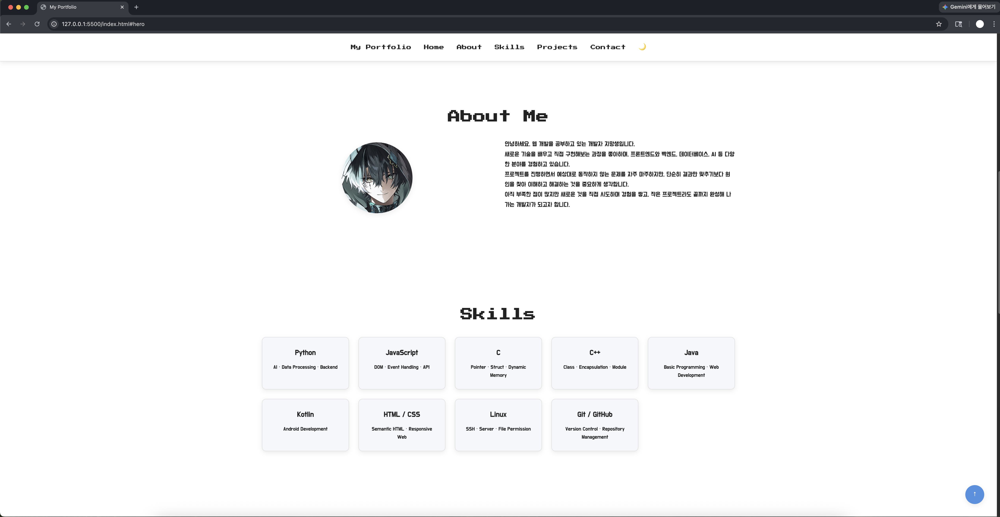
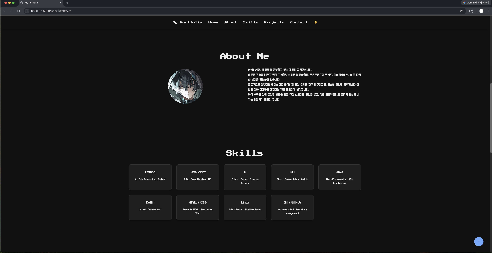
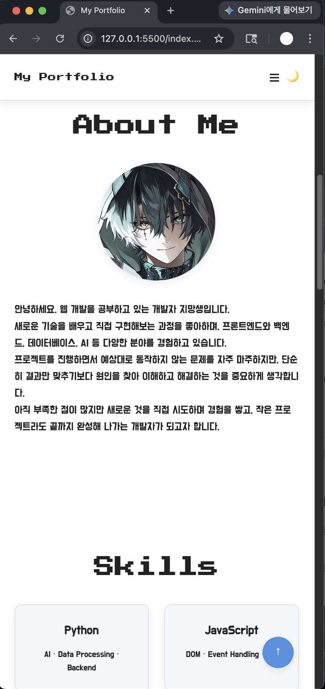
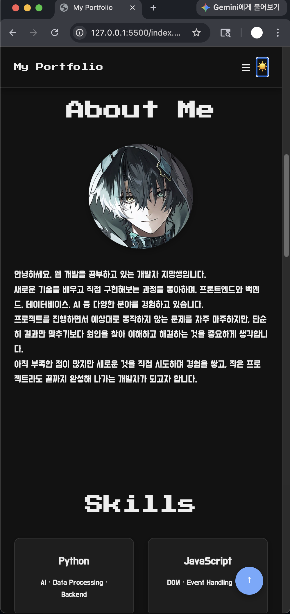
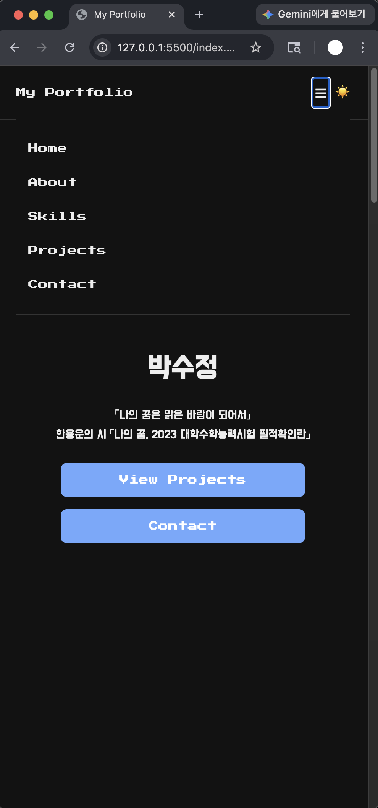

# Vanilla JavaScript Portfolio

순수 HTML, CSS, JavaScript로 만든 반응형 개인 포트폴리오입니다. 프레임워크나 UI 라이브러리 없이 이벤트, 상태, DOM 렌더링의 연결을 직접 구현했습니다.

## 배포 URL

GitHub Pages를 활성화한 뒤 다음 주소에서 확인할 수 있습니다.

`https://SJendministrator.github.io/<repository-name>/`

> GitHub 저장소의 **Settings → Pages**에서 `main` 브랜치와 `/ (root)`를 선택해 배포합니다. 저장소 이름에 맞춰 위 URL의 `<repository-name>`을 교체하세요.

## 스크린샷

| 데스크톱 라이트 | 데스크톱 다크 |
| --- | --- |
|  |  |

| 모바일 라이트 | 모바일 다크 | 모바일 메뉴 |
| --- | --- | --- |
|  |  |  |


## 요구 사항 검증 현황

| 항목 | 검증 결과 | 근거 |
| --- | --- | --- |
| 시맨틱 구조·반응형 Grid/Flexbox | 완료 | `index.html`의 시맨틱 태그와 `css/`의 모바일·768px·1024px 규칙을 정적 확인했습니다. |
| 햄버거·다크 모드·부드러운 스크롤·스크롤 UI·노출 애니메이션 | 구현 완료 | 이벤트 리스너, `localStorage`, `IntersectionObserver(0.2)`를 코드에서 확인했습니다. |
| GitHub API 로딩·성공·오류·빈 상태 | 구현 완료 / 실 API 확인 보류 | 코드에 모든 상태와 재시도 버튼이 있으며, 이 실행 환경의 프록시 403으로 GitHub API 실호출은 확인하지 못했습니다. |
| 문의 폼 검증 | 구현 완료 | 이름·이메일·메시지의 required, 이메일 정규식, 필드 근처 오류 메시지, 성공 메시지를 확인했습니다. |
| GitHub Pages 실제 URL | 미완료 | 이 저장소에는 원격 저장소 또는 Pages 배포 URL이 설정되어 있지 않아 실제 주소를 검증할 수 없습니다. |
| 데스크톱·모바일·다크 모드 스크린샷 | 완료 | `images/`의 데스크톱·모바일·다크 모드·모바일 메뉴 캡처를 README 스크린샷 섹션에 추가했습니다. |

## 사용 기술

- HTML5 시맨틱 마크업: `header`, `nav`, `main`, `section`, `article`, `footer`
- CSS3: CSS 변수, Flexbox 내비게이션, Grid 프로젝트 카드, 모바일 퍼스트 미디어 쿼리
- Vanilla JavaScript (ES6+): DOM 선택, 이벤트 리스너, 템플릿 리터럴, 구조 분해, `map`/`filter`/`forEach`
- GitHub REST API: 공개 저장소 목록을 동적으로 렌더링

## 주요 기능과 상태 흐름

1. **테마** — 토글 클릭 → `localStorage` 테마 상태 변경 → `data-theme` CSS 변수 렌더링. 새로고침 후에도 설정이 유지됩니다.
2. **프로젝트** — API 요청 → loading/success/error/empty 상태 변경 → 상태 메시지와 프로젝트 카드 UI 렌더링. 오류 시 재시도할 수 있습니다.
3. **문의 폼** — 입력/제출 이벤트 → 필수값 및 이메일 형식 유효성 상태 변경 → 필드 주변의 오류 또는 성공 메시지 렌더링.
4. **내비게이션** — 햄버거 클릭 → `active` 클래스 상태 변경 → 모바일 메뉴 표시/숨김. 앵커 클릭은 부드러운 스크롤로 연결됩니다.
5. **스크롤 UI** — 스크롤 위치 → 헤더/맨 위 버튼 클래스 변경 → 60px에서 헤더 스타일, 300px에서 맨 위 버튼을 표시합니다.
6. **스크롤 애니메이션** — `IntersectionObserver`가 섹션 진입을 감지하면 `is-visible` 클래스를 적용합니다. Observer `threshold`는 `0.2`입니다.

## 로컬 실행

1. 저장소를 VS Code에서 엽니다.
2. Live Server 확장으로 `index.html`을 실행합니다.
3. 최신 Chrome에서 반응형 레이아웃과 GitHub API 동작을 확인합니다.

GitHub API는 인증 없이 시간당 60회까지 요청할 수 있습니다. 제한에 도달하거나 네트워크 오류가 발생하면 Projects 섹션이 오류 메시지와 재시도 버튼을 표시합니다.

## GitHub API 콘솔 점검

브라우저에서 페이지를 연 후 **F12 → Console**에서 아래 명령어를 실행하면 GitHub API 연동 상태를 확인하거나, UI의 성공·빈 결과·실패 상태를 의도적으로 재현할 수 있습니다. 모든 명령어는 페이지 메모리와 Projects 영역만 변경하며 GitHub 저장소의 데이터는 수정하지 않습니다.

```js
// 현재 상태와 마지막 요청 오류를 확인합니다.
portfolioDebug.github.status()

// 실제 GitHub API를 다시 요청합니다. 성공하면 state는 "success"가 됩니다.
portfolioDebug.github.reload()

// API 응답을 기다리지 않고 성공 카드 UI를 재현합니다.
portfolioDebug.github.simulateSuccess()

// 공개 저장소가 없는 경우의 빈 결과 UI를 재현합니다.
portfolioDebug.github.simulateEmpty()

// 존재하지 않는 GitHub 사용자 API를 요청해 404 실패 UI를 의도적으로 재현합니다.
portfolioDebug.github.requestNotFound()
```

`reload()` 또는 `requestNotFound()`는 Promise를 반환하므로, 완료된 뒤 상태를 확인하려면 다음처럼 실행합니다.

```js
await portfolioDebug.github.reload()
portfolioDebug.github.status()
```

정상 연동에서는 `status()`의 `state`가 `success`이고 Projects 영역에 저장소 카드가 표시됩니다. `requestNotFound()` 뒤에는 `state`가 `error`이며 `lastError`에 `GitHub API request failed: 404`가 표시되고, 화면에는 재시도 버튼이 나타납니다. 테스트 후 실제 데이터를 다시 불러오려면 `portfolioDebug.github.reload()` 또는 화면의 **다시 시도** 버튼을 사용하세요.
